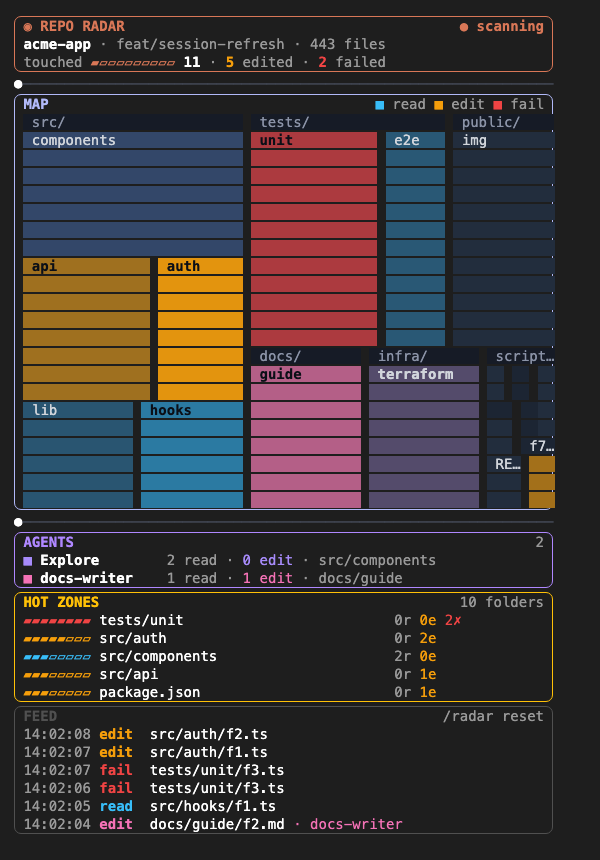

# repo-radar

A live map of your codebase that lights up wherever Claude is working.



A Flightdeck-style pane in rounded, colour-bordered panels:

- **Header**: repo, branch and file count, a live `● scanning` light, and how much of the repo this session touched.
- **Map**: your repo as tiles sized by file count, one per folder. Reads glow **cyan**, edits **amber**, failures **red**, and **each subagent glows in its own colour**, so you can watch parallel agents spread across the codebase. Glows fade like a radar trace; files touched this session keep a faint tint.
- **Agents**: each subagent by type (Explore, docs-writer…) with what it read and edited, and where.
- **Hot zones**: the folders with the most activity, with gauges.
- **Feed**: timestamped file events.

The map and the sweep line between panels animate on their own, without redrawing the pane, the same in the terminal and the desktop app. Docked beside a fullscreen transcript you get every panel; seated inline above the prompt it shrinks to a short summary.

## Install

```
/plugin marketplace add lakmadev/claude-mods
/plugin install repo-radar@claude-mods
```

`/radar` opens it; `/radar reset` clears the session's trail. With `openOnStart` (on by default), it docks beside the transcript at session start in terminals 144+ columns wide.

## What it reads

The file list (`git ls-files`, run once at start) and the path argument of each tool call. Nothing leaves your machine, nothing is written, and it never blocks or changes a tool call.
