# repo-radar

A live map of your codebase that lights up wherever Claude is working.



Your repo is drawn as a **map of rectangles**: one per top folder, split into its subfolders and sized by file count. As Claude works, the map glows:

- **cyan**: a file was read or searched
- **amber**: a file was edited or written
- **red**: a tool call on that file failed
- **a colour per subagent**: run parallel agents and watch them spread across the repo at the same time

Glows fade like a radar trace, and every file touched this session keeps a faint tint, so by the end you can see how much of the repo the session changed. A live feed under the map shows the latest file events.

In the terminal it's an animated character grid (about 7 frames a second while something is glowing, idle otherwise). In the desktop app it's an SVG whose glows fade on their own, with the full path on hover.

## Install

```
/plugin install repo-radar --marketplace lakmadev/claude-mods
```

`/radar` opens it; `/radar reset` clears the session's trail. With `openOnStart` (on by default), it docks beside the transcript at session start in terminals 144+ columns wide.

## What it reads

The file list (`git ls-files`, run once at start) and the path argument of each tool call. Nothing leaves your machine, nothing is written, and it never blocks or changes a tool call.
